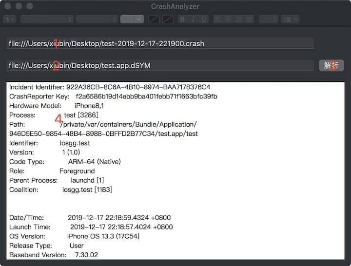

# CrashAnalyzer

1. click to select and add a crash file
2. click to select and add a dsym file
3. click to analyze
4. get the result

### TODO

- [ ] 支持拖拽选择文件
- [ ] 支持快捷键打开文件
- [ ] 支持快捷键复制、导出结果
- [ ] 支持一次解析多个日志文件